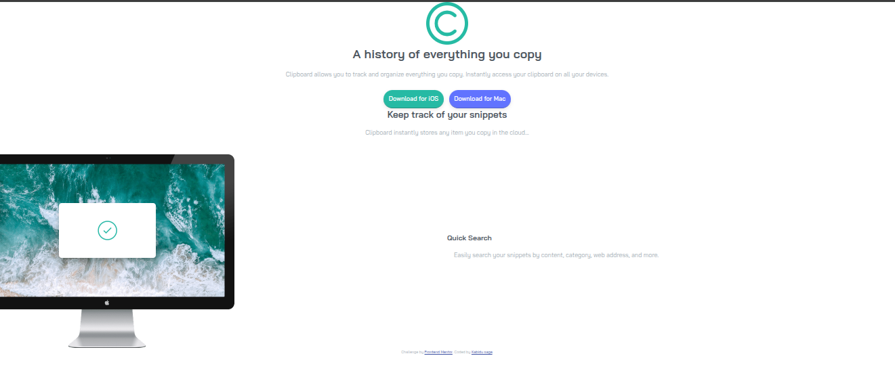

# Frontend Mentor - Clipboard landing page solution

This is a solution to the [Clipboard landing page challenge on Frontend Mentor](https://www.frontendmentor.io/challenges/clipboard-landing-page-5cc9bccd6c4c91111378ecb9). Frontend Mentor challenges help you improve your coding skills by building realistic projects.

## Table of contents

- [Overview](#overview)
  - [The challenge](#the-challenge)
  - [Screenshot](#screenshot)
  - [Links](#links)
- [My process](#my-process)
  - [Built with](#built-with)
  - [What I learned](#what-i-learned)
  - [Continued development](#continued-development)
  - [Useful resources](#useful-resources)
- [Author](#author)
- [Acknowledgments](#acknowledgments)

## Overview

### The challenge

Users should be able to:

- View the optimal layout for the site depending on their device's screen size
- See hover states for all interactive elements on the page

### Screenshot



### Links

- Solution URL: [GitHub Repository](https://github.com/yourusername/clipboard-landing-page)
- Live Site URL: [Live Demo](https://yourusername.github.io/clipboard-landing-page)

## My process

### Built with

- Semantic HTML5 markup
- CSS custom properties
- Flexbox
- CSS Grid
- Mobile-first workflow

### What I learned

During this project, I improved my skills in responsive web design using CSS Flexbox and Grid. I learned how to create hover effects and ensure accessibility with proper semantic HTML.

```css
.feature-grid {
  display: grid;
  grid-template-columns: 1fr 1fr;
  gap: 2rem;
}
```

### Continued development

In future projects, I want to focus on adding JavaScript for interactivity and improving performance with lazy loading images.

### Useful resources

- [Frontend Mentor](https://www.frontendmentor.io) - For the challenge and community support.
- [MDN Web Docs](https://developer.mozilla.org) - For HTML and CSS references.
- [CSS Grid Guide](https://css-tricks.com/snippets/css/complete-guide-grid/) - Helped with understanding CSS Grid.


## Author

- Frontend Mentor - [@Kabidu Munguakonkwa Sage](https://www.frontendmentor.io/profile/Abidusage)
- GitHub - [@kabidu Munguakonkwa Sage](https://github.com/Abidusage)

## Acknowledgments

Thanks to Frontend Mentor for providing this challenge and the design assets. Special thanks to the community for feedback and inspiration.
